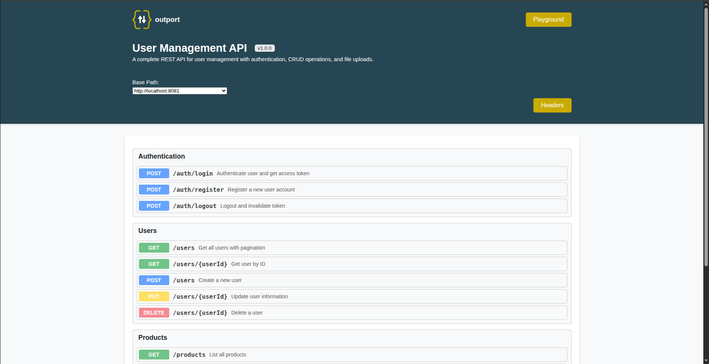

# Outport

[](https://www.npmjs.com/package/outport)
[](https://www.npmjs.com/package/outport)
[](https://github.com/GMShahzaib/outport/blob/main/LICENSE)

A lightweight API documentation and testing library for Express.js. Define, test, and visualize your API endpoints with an interactive UI.

**[GitHub](https://github.com/GMShahzaib/outport)**



---

## Features

- Interactive API documentation UI
- Built-in API testing (like Postman)
- Playground for custom requests
- Path parameters, query params, headers, and body support
- JSON and Form/Multipart body types
- Multiple server environments
- File upload support
- TypeScript support
- Zero configuration required

---

## Installation

```bash
npm install outport
```

---

## Quick Start

```javascript
import express from 'express';
import Outport from 'outport';

const app = express();

const outport = new Outport({
  title: 'My API',
  version: '1.0.0',
  description: 'API documentation powered by Outport',
  servers: ['http://localhost:3000']
});

outport.use('Users', [
  {
    path: '/users',
    method: 'GET',
    summary: 'Get all users'
  }
]);

app.use('/docs', outport.serve());
app.listen(3000);
```

Open `http://localhost:3000/docs` to view your documentation.

---

## Configuration Options

### Outport Constructor

| Option | Type | Required | Default | Description |
|--------|------|----------|---------|-------------|
| `title` | string | Yes | - | API documentation title |
| `version` | string | Yes | - | API version |
| `description` | string | Yes | - | API description |
| `servers` | string[] | No | - | List of server URLs |
| `headers` | Header[] | No | - | Global headers for all endpoints |
| `playground` | boolean | No | `true` | Enable/disable playground page |
| `timeout` | number | No | `60000` | Request timeout in milliseconds (max: 600000) |

### Endpoint Options

| Option | Type | Required | Description |
|--------|------|----------|-------------|
| `path` | string | Yes | Endpoint path (supports `{param}` syntax) |
| `method` | string | Yes | `GET`, `POST`, `PUT`, `DELETE`, `PATCH` |
| `summary` | string | Yes | Short description |
| `description` | string | No | Detailed description |
| `headers` | Header[] | No | Endpoint-specific headers |
| `parameters` | Parameter[] | No | Query parameters |
| `body` | Body | No | Request body configuration |
| `responses` | Response[] | No | Example responses |

### Type Definitions

```typescript
interface Header {
  key: string;
  value: string;
  description?: string;
}

interface Parameter {
  key: string;
  value: string;
  description?: string;
}

interface Body {
  type: 'json' | 'form';
  data: BodyData[];
}

interface BodyData {
  key: string;
  value?: any;
  description?: string;
  type?: 'text' | 'file';  // For form body only
}

interface Response {
  status: number;
  description: string;
  value?: object | string;
  headers?: Header[];
}
```

---

## Examples

### Path Parameters

```javascript
outport.use('Users', [
  {
    path: '/users/{userId}',
    method: 'GET',
    summary: 'Get user by ID',
    responses: [
      {
        status: 200,
        description: 'User found',
        value: { id: 1, name: 'John Doe' }
      },
      {
        status: 404,
        description: 'User not found',
        value: { error: 'User not found' }
      }
    ]
  }
]);
```

### Query Parameters

```javascript
outport.use('Users', [
  {
    path: '/users',
    method: 'GET',
    summary: 'List users with pagination',
    parameters: [
      { key: 'page', value: '1', description: 'Page number' },
      { key: 'limit', value: '10', description: 'Items per page' },
      { key: 'sort', value: 'name', description: 'Sort field' }
    ]
  }
]);
```

### JSON Body

```javascript
outport.use('Authentication', [
  {
    path: '/login',
    method: 'POST',
    summary: 'User login',
    body: {
      type: 'json',
      data: [
        { key: 'email', value: 'user@example.com' },
        { key: 'password', value: 'secret123' }
      ]
    },
    responses: [
      {
        status: 200,
        description: 'Login successful',
        value: {
          token: 'eyJhbGciOiJIUzI1NiIs...',
          user: { id: 1, email: 'user@example.com' }
        }
      }
    ]
  }
]);
```

### Form Body with File Upload

```javascript
outport.use('Files', [
  {
    path: '/upload',
    method: 'POST',
    summary: 'Upload a file',
    body: {
      type: 'form',
      data: [
        { key: 'title', value: 'My Document', type: 'text' },
        { key: 'description', value: 'A sample file', type: 'text' },
        { key: 'file', type: 'file' }
      ]
    },
    responses: [
      {
        status: 200,
        description: 'File uploaded',
        value: { fileId: 'abc123', url: '/files/abc123' }
      }
    ]
  }
]);
```

### Global Headers

```javascript
const outport = new Outport({
  title: 'My API',
  version: '1.0.0',
  description: 'API with authentication',
  servers: ['http://localhost:3000'],
  headers: [
    {
      key: 'Authorization',
      value: 'Bearer your-token-here',
      description: 'JWT authentication token'
    },
    {
      key: 'X-API-Key',
      value: 'your-api-key',
      description: 'API key for rate limiting'
    }
  ]
});
```

### Multiple Server Environments

```javascript
const outport = new Outport({
  title: 'My API',
  version: '1.0.0',
  description: 'Multi-environment API',
  servers: [
    'http://localhost:3000',
    'https://staging.api.example.com',
    'https://api.example.com'
  ]
});
```

### Response Headers

```javascript
outport.use('Files', [
  {
    path: '/download/{fileId}',
    method: 'GET',
    summary: 'Download a file',
    responses: [
      {
        status: 200,
        description: 'File download',
        headers: [
          { key: 'Content-Type', value: 'application/octet-stream' },
          { key: 'Content-Disposition', value: 'attachment; filename="file.pdf"' }
        ]
      }
    ]
  }
]);
```

---

## Playground

Outport includes a Playground page for testing any API endpoint. Access it at `/docs/playground`.

Features:
- Custom URL input
- All HTTP methods
- Headers management
- Query parameters
- JSON and Form body
- Response viewer with headers

To disable the playground:

```javascript
const outport = new Outport({
  // ...
  playground: false
});
```

---

## CommonJS Usage

```javascript
const Outport = require('outport').default;

const outport = new Outport({
  title: 'My API',
  version: '1.0.0',
  description: 'CommonJS example'
});
```

---

## TypeScript Support

Outport is written in TypeScript and includes type definitions. Import types directly:

```typescript
import Outport, {
  Endpoint,
  Header,
  Parameter,
  BodyData,
  ExampleResponse,
  APIDocumentation
} from 'outport';

const endpoints: Endpoint[] = [
  {
    path: '/users',
    method: 'GET',
    summary: 'Get users'
  }
];

outport.use('Users', endpoints);
```

---

## Express Integration

```javascript
import express from 'express';
import Outport from 'outport';

const app = express();

// Your API routes
app.get('/users', (req, res) => {
  res.json([{ id: 1, name: 'John' }]);
});

app.post('/users', (req, res) => {
  res.json({ id: 2, name: req.body.name });
});

// Outport documentation
const outport = new Outport({
  title: 'User API',
  version: '1.0.0',
  description: 'User management endpoints',
  servers: ['http://localhost:3000']
});

outport.use('Users', [
  {
    path: '/users',
    method: 'GET',
    summary: 'Get all users'
  },
  {
    path: '/users',
    method: 'POST',
    summary: 'Create a user',
    body: {
      type: 'json',
      data: [{ key: 'name', value: 'John Doe' }]
    }
  }
]);

app.use('/docs', outport.serve());

app.listen(3000, () => {
  console.log('Server running on http://localhost:3000');
  console.log('Docs available at http://localhost:3000/docs');
});
```

---

## Peer Dependencies

- Express >= 4.0.0

---

## Contributing

Contributions are welcome! See [CONTRIBUTING.md](CONTRIBUTING.md) for guidelines.

---

## License

ISC License - see [LICENSE](LICENSE) for details.

---

## Author

**Mirza Shahzaib** - [GitHub](https://github.com/GMShahzaib) | [Email](mailto:gms.shahzaib@gmail.com)
